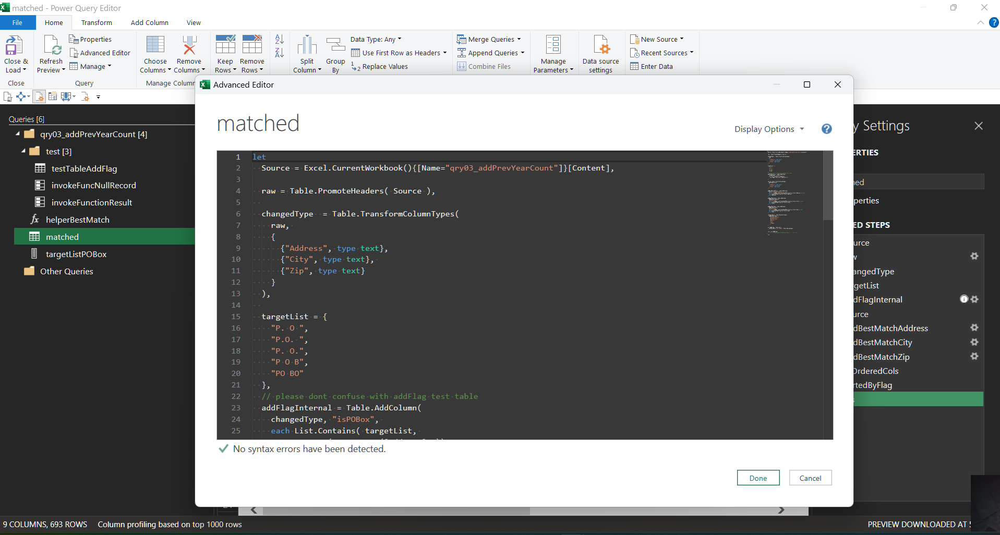

# m-code (mash-up)
* [official microsoft documentation](https://learn.microsoft.com/en-us/power-query/)

# [AT Codes](https://github.com/attila5287/power-query-m-code/tree/main/ref)

* Microsoft Power Query provides a powerful "get data" experience that encompasses many features. A core capability of Power Query is to filter and combine, that is, to "mash-up" data from one or more of a rich collection of supported data sources. Any such data mashup is expressed using the Power Query formula language (informally known as "M"). Power Query embeds M documents in a wide range of Microsoft products, including Excel, Power BI, Analysis Services, and Dataverse, to enable repeatable mashup of data.

* In any data transformation scenario, there are some transformations that can't be done in the best way by using the graphical editor. Some of these transformations might require special configurations and settings that the graphical interface doesn't currently support. The Power Query engine uses a scripting language behind the scenes for all Power Query transformations: the Power Query M formula language, also known as M.

* The M language is the data transformation language of Power Query. Anything that happens in the query is ultimately written in M. If you want to do advanced transformations using the Power Query engine, you can use the advanced editor to access the script of the query and modify it as you want. If you find that the user interface functions and transformations can't perform the exact changes you need, use the advanced editor and the M language to fine-tune your functions and transformations.

 
 
 
 
 

